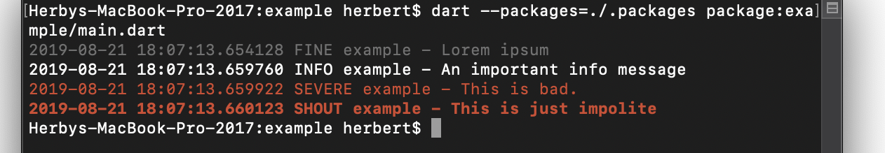
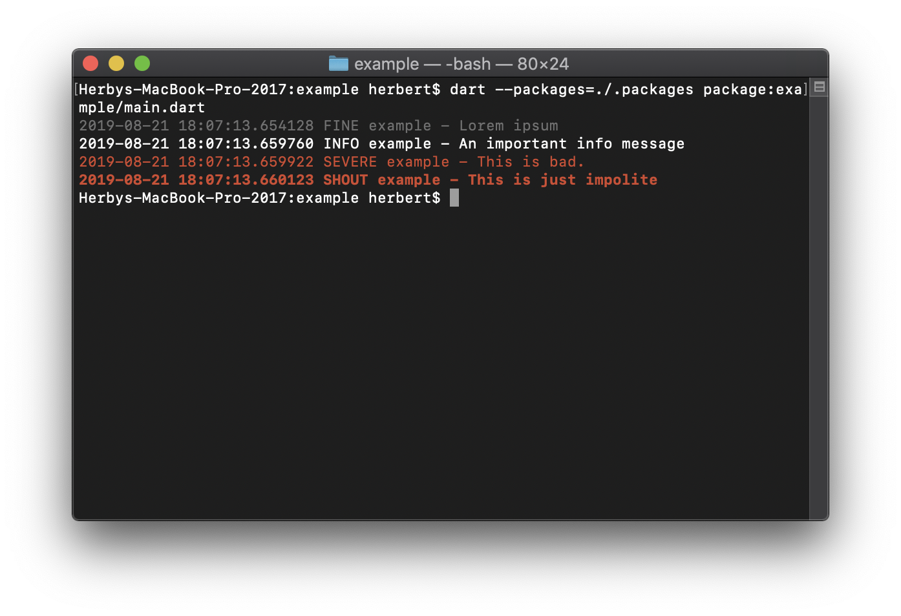

# logging_appenders

[](https://pub.dartlang.org/packages/logging_appenders)
[](https://codecov.io/gh/hpoul/dart_logging_appenders)

Native dart package for logging appenders usable with the [logging](https://pub.dartlang.org/packages/logging) package.



It currently includes appenders for:

* Local Logging
    * `print()` [PrintAppender](https://pub.dev/documentation/logging_appenders/latest/logging_appenders/PrintAppender-class.html)
    * Rolling File Appender. [RotatingFileAppender](https://pub.dev/documentation/logging_appenders/latest/logging_appenders/RotatingFileAppender-class.html)
* Remote Logging
    * [logz.io](https://logz.io/) 
    * [loki](https://github.com/grafana/loki).
    * [gelf/Graylog](https://go2docs.graylog.org/5-0/getting_in_log_data/ingest_gelf.html)

## Performance of Remote Logging Appenders

I am not sure if it is wise to use this in production, but it's great during beta testing with
a handful of users so you have all logs available.

It tries to stay reasonable performant by batching log entries and sending them off only every few
seconds. If network is down it will retry later. (with an ever increasing interval).

# Getting Started

After installing package `logging` and `logging_appenders`:

```dart
import 'package:logging/logging.dart';
import 'package:logging_appenders/logging_appenders.dart';

final _logger = Logger('main');

void main() {
  PrintAppender.setupLogging();

  // The above code is the same as:
  // Logger.root.level = Level.ALL;
  // PrintAppender()..attachToLogger(Logger.root);

  _logger.fine('Lorem ipsum');
}
```

Outputs:

```
$ dart main.dart
2019-08-19 15:36:03.827563 FINE main - Lorem ipsum
```

# Support for Exception chaining

To chain exception you can use the extension method on `Exception`:
`causedBy()`.

```dart
int test() {
  try {
    int.parse('a');
  } catch (e, stackTrace) {
    throw Exception('unable to parse').causedBy(e, stackTrace);
  }
}
int main() {
  try {
    test();
  } catch (e, stackTrace) {
    logger.severe('catched Exception', e, stackTrace);
  }
}
```

# Color Formatter

```dart
    PrintAppender(formatter: const ColorFormatter())
        ..attachToLogger(Logger.root);
```

Produces:



# Logging to stderr

When using `dart:io` (ie. command line apps) it is possible to
define which log levels should go to `stderr` instead of `stdout`:

```
PrintAppender.setupLogging(stderrLevel: Level.SEVERE);
```

# Remote Appenders

## Appender for logz.io

```dart
  final _logzIoApiSender = LogzIoApiAppender(
    // you can find your API key and the required URL from 
    // the logz.io dashboard: https://app-eu.logz.io/#/dashboard/settings/general
    apiToken: 'MY API KEY',
    url: 'https://listener-eu.logz.io:8071/',
    labels: {'app': 'MyApp', 'os': Platform.operatingSystem},
  );
  _logzIoApiSender.attachToLogger(Logger.root);
  
  
  // ...
  If you know that you no longer need the appender. it's good to dispose it:
  _logzIoApiSender.dispose();
```
